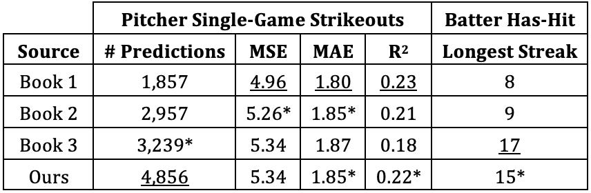

# Learning Contextual Event Embeddings to Predict Player Performance in the MLB

This repository contains the code and (links to) data required to reproduce the 
experiments described in the abstract/paper "Learning Contextual Event Embeddings 
to Predict Player Performance in the MLB." 

Our models are able to make pitcher single-game strikeout and batter has-hit predictions that are
competitive with three major sportsbooks in the US. A comparison of the predictions is presented below.
It is important to note the following:
1. Our model uses **only 10 games** worth of play-by-play data to make predictions
2. Our batter has-hit predictions reflect the batter recording a hit off of the **starting pitcher only**,
while the books' predictions reflect a batter recording a hit during the **entire game**, arguably an easier task

## Preliminaries
Before models can be trained, the data must be downloaded. 

1. Download at-bat sequence files [here]()
   1. Extract the data, and remember the location of the `ab_seqs_v17_ssac` as it will be needed later.

## Pre-training
To train the model described in the paper, simply execute the [run_modeling.sh](scripts/run_modeling.sh) script found in
the [scripts](scripts/) folder. The model will take approximately 24-30 hours to train with the given parameters.
* **Note**: before running the script, please change the `AB_DATA` variable to match the location of the `ab_seqs_v17_ssac`
directory mentioned above.

## Fine-tuning to Predict Performance
To fine-tune the pre-trained model for performance prediction, simply execute the [run_finetune.sh](scripts/run_finetune.sh)
script found in the [scripts](scripts/) folder. Fine-tuning will take approximately 4 hours with the given parameters.
If you wish to use a different pre-trained model, modify the filepath given as the `--model_ckpt` argument.